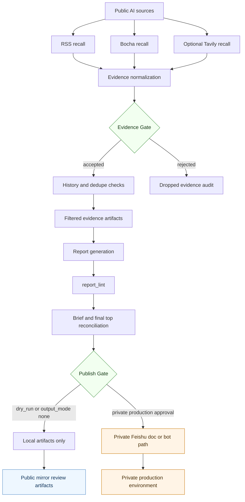
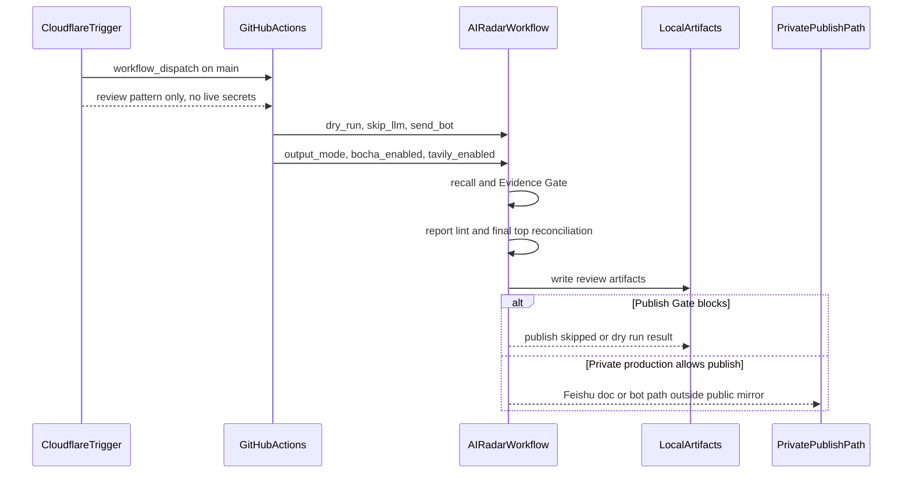
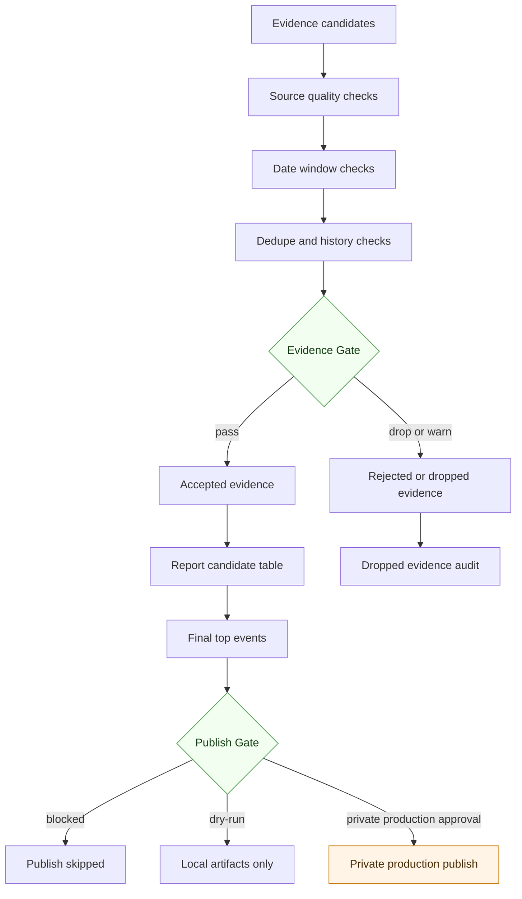
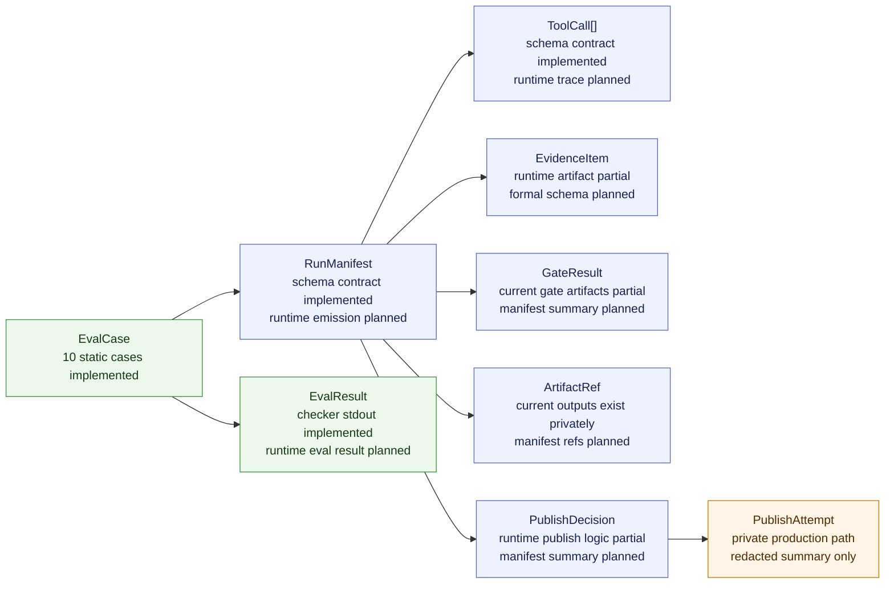
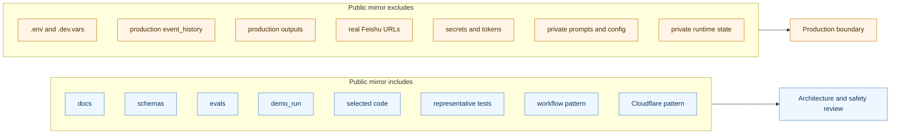

# Architecture Overview

## Purpose

This is a visual guide for the sanitized public mirror of AI Radar Agent.

The diagrams show the reviewable architecture, safety gates, observability
contracts, and public mirror boundary. They do not imply that this repository
is connected to live Cloudflare, Feishu, provider, or production GitHub
deployment settings.

For operating principles and decision strategy, see
[docs/STRATEGY_PANEL.md](STRATEGY_PANEL.md).

## 1. End-to-End Agent Workflow

The public mirror is review-only. Feishu publishing, bot notification, provider
keys, and production state remain private production concerns.

## 2. Trigger and Control Plane

The public mirror includes the trigger pattern so reviewers can inspect the
control surface. It is not a live deployment and does not include bearer
secrets, GitHub secrets, provider keys, Feishu credentials, or Cloudflare
account settings.

## 3. Evidence Gate and Publish Gate

The design goal is simple: unsupported or stale evidence should not become
confident report narrative, and publish side effects should be blocked unless
the production environment and operator intent allow them.

## 4. Observability Object Map

The schemas are reviewable in this mirror. First-class runtime emission of
`RunManifest`, `ToolCall`, and richer `EvalResult` artifacts remains planned
or partial, as documented in the observability and runtime object map docs.

## 5. Public Mirror Boundary

Reviewer note: this mirror is optimized for architecture, workflow, safety,
eval, schema, and demo review. It is not a turnkey production deployment repo.
