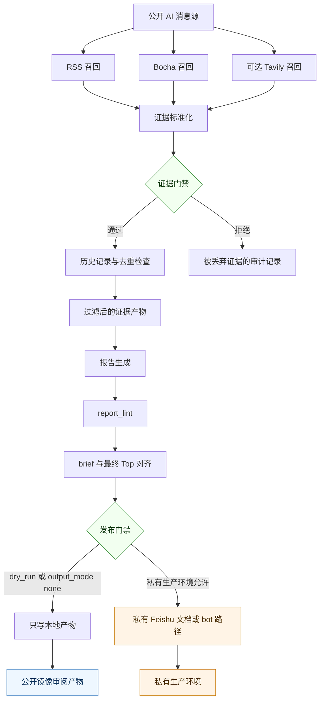
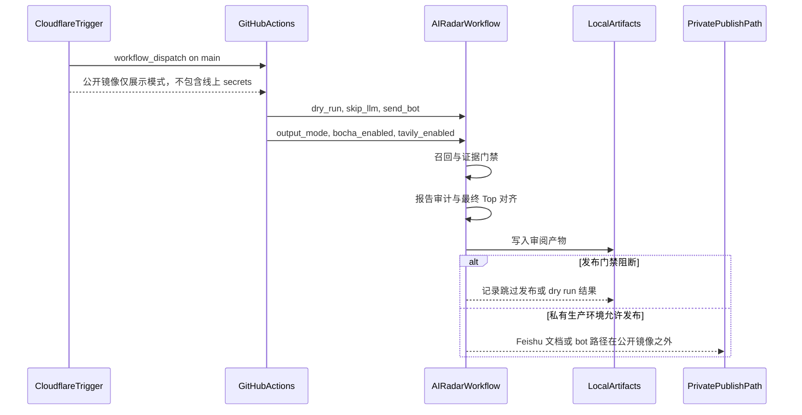
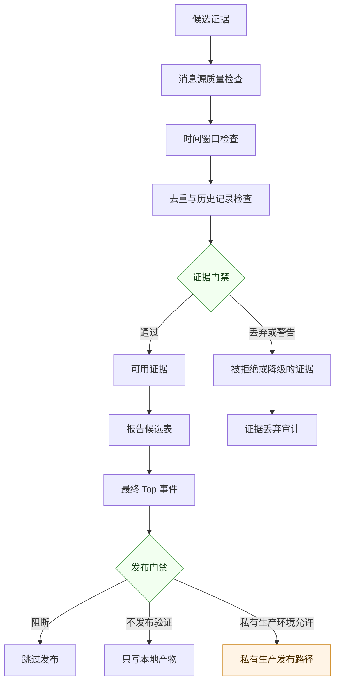
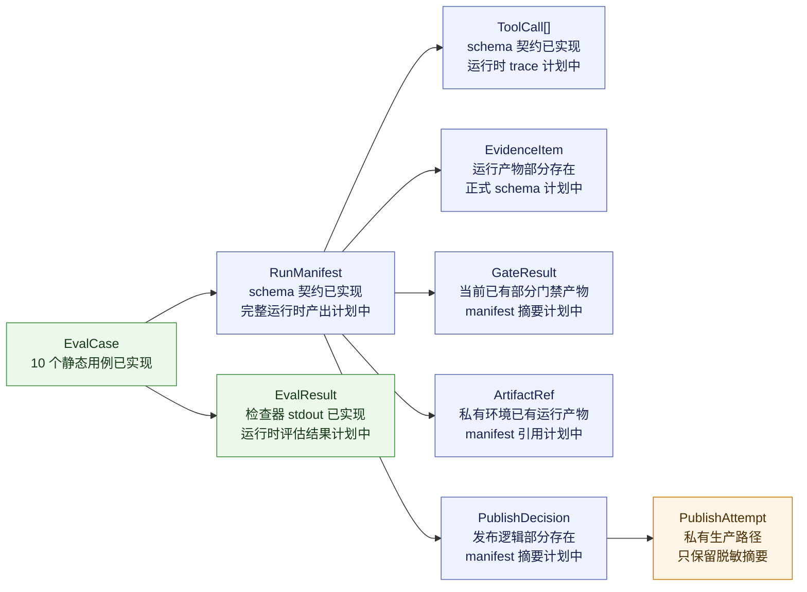
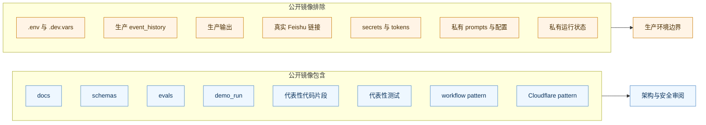

# 架构总览

## 目的

这份文档用图示说明 AI Radar Agent 脱敏公开镜像中的关键设计：证据优先工作流、
触发控制面、证据门禁（Evidence Gate）、发布门禁（Publish Gate）、
可观测对象，以及公开仓库与私有生产环境之间的边界。

这些图用于帮助审阅者快速理解系统形状。它们不表示本仓库连接了真实
Cloudflare、Feishu、provider 或 GitHub Actions 生产运行配置。

运行原则和决策策略见 [Agent 策略面板](STRATEGY_PANEL.md)。

## 1. 端到端工作流

公开镜像只展示可审阅的工作流和脱敏产物。Feishu 发布、bot 通知、provider keys
和生产状态都属于私有生产环境。

## 2. 触发与控制面

公开镜像保留触发模式，是为了让审阅者检查控制面设计。它不包含 bearer secrets、
GitHub secrets、provider keys、Feishu credentials 或 Cloudflare account settings。

## 3. 证据门禁与发布门禁

核心目标是：缺少来源支撑、过期或重复的证据不应被写成确定性结论；
任何外部发布动作都必须先通过发布门禁。

## 4. 可观测对象关系

公开镜像中的 schemas 可供审阅。`RunManifest`、`ToolCall` 和更完整的
`EvalResult` 运行时产出仍处于计划中或部分实现状态，这一点也在可观测性和运行时对象图文档中说明。

## 5. 公开镜像边界

审阅提示：本镜像用于理解架构、工作流、安全边界、评估、schema 和脱敏演示产物，
不是可直接部署的生产仓库。
