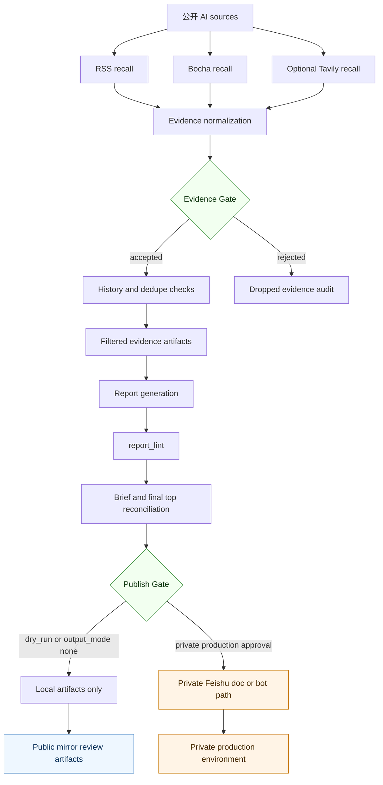
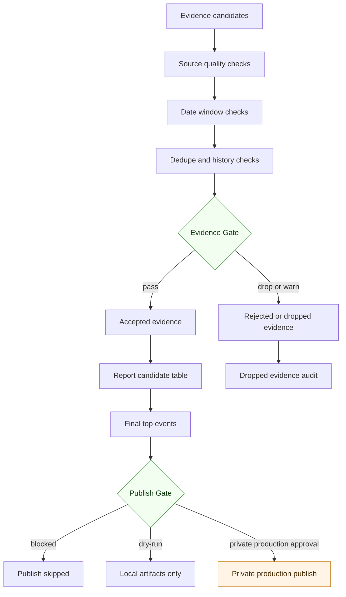
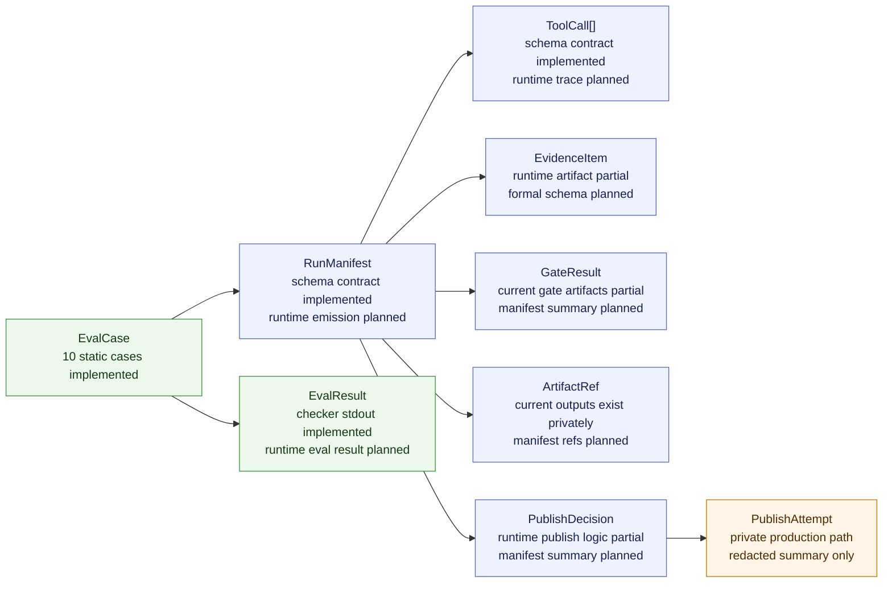
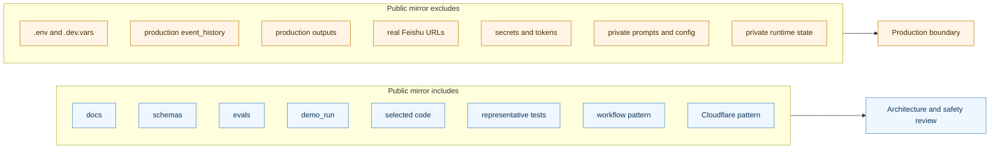

# 架构总览

## 目的

这是一份面向 AI Radar Agent 脱敏公开镜像的可视化说明。

这些图用于帮助 reviewer 理解可审阅的 architecture、safety gates、
observability contracts 和 public mirror boundary。它们不表示本仓库连接了
真实 Cloudflare、Feishu、provider 或 GitHub 生产运行配置。

## 1. End-to-End Agent Workflow



公开镜像只用于 review。Feishu 发布、bot notification、provider keys 和
production state 都属于私有生产环境边界。

## 2. Trigger and Control Plane

```mermaid
sequenceDiagram
  participant CF as Cloudflare cron or manual trigger
  participant GH as GitHub workflow_dispatch
  participant WF as AI Radar workflow
  participant ART as Local artifacts
  participant PUB as Private production publish path

  CF->>GH: dispatch main workflow
  Note over CF,GH: Public mirror only shows the pattern; no live secrets included
  GH->>WF: inputs dry_run, skip_llm, send_bot
  GH->>WF: inputs output_mode, bocha_enabled, tavily_enabled
  WF->>WF: recall, Evidence Gate, report lint, final top reconciliation
  WF->>ART: write review artifacts
  alt Publish Gate blocks
    WF-->>ART: publish skipped or dry-run result
  else Private production allows publish
    WF-->>PUB: Feishu doc or bot path outside public mirror
  end
```

公开镜像包含 trigger pattern，是为了让 reviewer 检查控制面设计。它不是
live deployment，也不包含 bearer secrets、GitHub secrets、provider keys、
Feishu credentials 或 Cloudflare account settings。

## 3. Evidence Gate and Publish Gate



核心设计目标是：缺少支撑、过期或重复的 evidence 不应该被写成确定性叙事；
外部发布副作用必须被 Publish Gate 挡住，除非生产环境配置和人工意图都允许。

## 4. Observability Object Map



公开镜像中的 schemas 可以被审阅。`RunManifest`、`ToolCall` 和更完整的
`EvalResult` runtime emission 仍是 planned 或 partial，这一点在 observability
和 runtime object map 文档中也有说明。

## 5. Public Mirror Boundary



Reviewer note：这个 mirror 面向 architecture、workflow、safety、eval、
schema 和 demo review，不是 turnkey production deployment repo。
